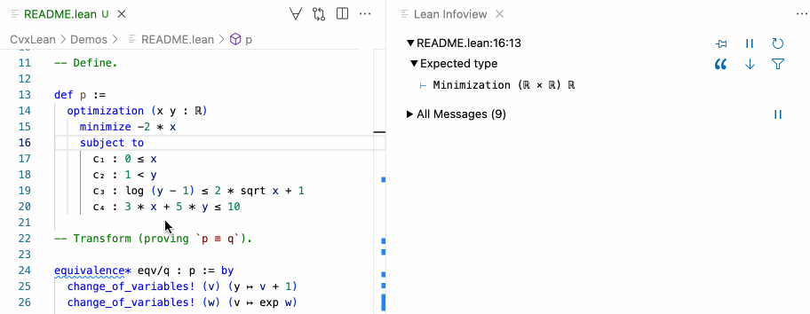

# CvxLean

CvxLean is a convex optimization modeling framework written in [Lean 4](https://leanprover.github.io/lean4/doc/).

Problems are stated using definitions from [mathlib](https://github.com/leanprover-community/mathlib) and can be rigorously transformed both automatically and interactively. They can be solved by calling the backend solver [MOSEK](https://www.mosek.com/).

Our main contribution is a verified version of the [disciplined convex programming (DCP)](https://web.stanford.edu/~boyd/papers/disc_cvx_prog.html) canonization algorithm.

Link to docs here.

Summary of main features.

## Installation

You will need to install Lean 4 and MOSEK following these steps:
1. Set up Lean 4 (see [these instructions](https://leanprover.github.io/lean4/doc/setup.html)). The easiest way is to use the `elan` version manager. 
2. If you're using VSCode, install the [Lean 4 extension](https://marketplace.visualstudio.com/items?itemName=leanprover.lean4).
3. Download [MOSEK 10.0.12(BETA)](https://www.mosek.com/downloads/10.0.12/) and ensure that the `mosek` binary is available on your `$PATH`. To avoid any issues with this, we recommend also adding it to `CvxLean/Command/Solve/Mosek/Path.lean`.
4. Obtain a [MOSEK license](https://www.mosek.com/license/request/?i=trl) and place it in your home directory, i.e. `$HOME/mosek/mosek.lic`.

Finally, go into the top `CvxLean` directory and run:

```
./build.sh
```

## Usage

The best way to get started is to take a look at the examples in `Test/Problems`. Here we follow the example in `Test/Problems/SO.lean`.

### Defining problems

Consider the optimization problem:

$$
\begin{align*}
\textrm{maximize}   &&& \sqrt{x - y} \\
\textrm{subject to} &&& y = 2 x - 3, \\
                    &&& x ^ 2 \le 2.
\end{align*}
$$

In CvxLean, it is defined as follows:

```lean
def p :=
  optimization (x y : ℝ)
    maximize sqrt (x - y)
    subject to
      c1 : y = 2 * x - 3
      c2 : x ^ 2 ≤ 2
      c3 : 0 ≤ x - y
```
There are a couple of implementation details here. 
 we require the extra condition `0 ≤ x - y` 

Once `p` has been defined, we can ask CvxLean to solve it.

### Solving problems

```lean
solve p 
```

It will show MOSEK's output and its return code, which should be zero.

If successful, it will add several definitions to the environment:
* `so1.conicForm`: the conic form of the problem after applying DCP.
* `so1.status`: the feasibility status of the primal and the dual problem, in this case `"PRIMAL_AND_DUAL_FEASIBLE"`, i.e. optimal.
* `so1.value`: if the problem is optimal, it corresponds to its optimal value.
* `so1.solution`: if the problem is optimal, it corresponds to the optimal point.

### Transforming problems

#### Commands for user-guided transformations

Problems can also be reduced interactively using the `reduction` command. As a simple example, suppose our problem has $e^x e^y$ in one of the constraints, which is not allowed by the DCP procedure, and we want to replace the expression with $e^{x+y}$. We can do it as follows:
```lean
reduction red/prob :
  optimization (x y : ℝ)
    maximize x + y
    subject to
      h : (exp x) * (exp y) ≤ 10 := by
  conv_constr => rw [← Real.exp_add]

#print prob
-- def prob : Minimization (Real × Real) Real :=
-- optimization (x : Real) (y : Real) 
--   maximize x + y
--   subject to
--     h : exp (x + y) ≤ 10
```
The transformation is done in a verified way using the lemma `Real.exp_add` [from mathlib](https://github.com/leanprover-community/mathlib/blob/master/src/data/complex/exponential.lean#L408), which says that $e^{x+y} = e^x e^y$. CvxLean generates a proof of the fact that given a solution to the reduced problem we can recover a solution to the original problem.

#### Equivalence-preserving tactics 

Automated: 
* `dcp`
* `pre_dcp`

User-directed:
* `conv_constr`
* `conv_obj`
* ...

## Quick demo 

We show how to rigorously transform and solve the following problem in `CvxLean`:

$$
\begin{align*}
\textrm{minimize}   &&& -2x \\
\textrm{subject to} &&& 0 \leq x, \\
                    &&& 1 < y, \\
                    &&& \log(y - 1) ≤ 2\sqrt{x} + 1, \\
                    &&& 3x + 5y ≤ 10. \\
\end{align*}
$$

The solution is (5/3, 1).



You can find this example in `CvxLean/Demos/README.lean`.

## Contributing 

Guidelines, style, commit messages, etc.

Troubleshooting??? Maybe not.
